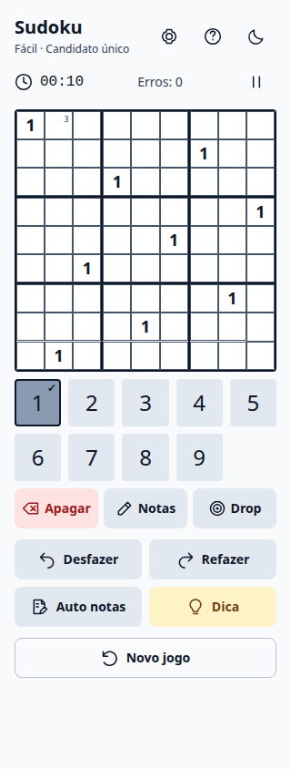
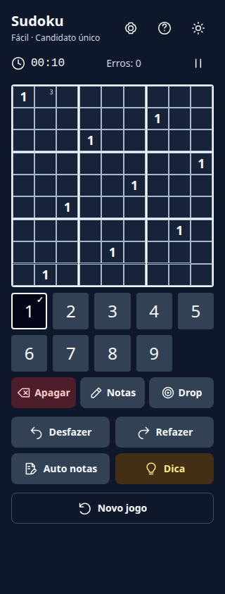

# Completed-number contrast

Chromium captures at 320×844, with the completed-number slider at its default
100%. The fixture has nine correct occurrences of 1. Its keypad button has
stronger shading, an outline and a checkmark. Other digits remain available.
These captures verify browser layout; they do not establish physical-device or
screen-reader acceptance.

| Light | Dark |
| --- | --- |
|  |  |

Generate additional captures with `tests/completed-contrast-browser.mjs` using
the optional Playwright environment documented in README.md. Outputs go to
`/tmp/sudoku-completed-contrast`.
